# 一、史前时代【1623——1895】
1623年：德国科学家契克卡德（W. Schickard）制造了人类有史以来第一台机械计算机，这台机器能够进行六位数的加减乘除运算。

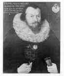

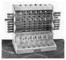

1642年：法国科学家帕斯卡（B.Pascal）发明了著名的帕斯卡机械计算机，首次确立了计算机器的概念。

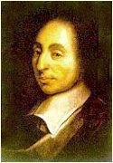

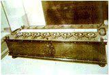

1674年：莱布尼茨改进了帕斯卡的计算机，使之成为一种能够进行连续运算的机器，并且提出了“二进制”数的概念。（据说这个概念来源于中国的八卦）

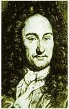

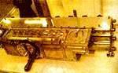

1725年：法国纺织机械师布乔（B.Bouchon）发明了“穿孔纸带”的构想。

1805年： 法国机械师杰卡德（J.Jacquard）根据布乔“穿孔纸带”的构想完成了“自动提花编织机”的设计制作，在后来电子计算机开始发展的最初几年中，在多款著名计算机中我们均能找到自动提花机的身影。

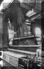

1822年：英国科学家巴贝奇（C.Babbage）制造出了第一台差分机，它可以处理3个不同的5位数，计算精度达到6位小数。

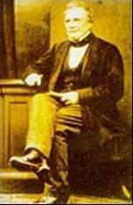

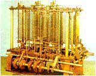

1834年：巴贝奇提出了分析机的概念，机器共分为三个部分：堆栈，运算器，控制器。他的助手， 英国著名诗人拜伦的独生女阿达.奥古斯塔（Ada Augusta）为分析机编制了人类历史上第一批计算机程序。阿达和巴贝奇为计算机的发展创造了不朽的功勋，他们对计算机的预见起码超前了一个世纪以上，正是他们的辛勤努力，为后来计算机的出现奠定了坚实的基础。

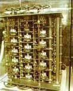

1847年：英国数学家布尔（G.Boole）发表著作《逻辑的数学分析》。

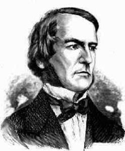

1854年：布尔发表《思维规律的研究——逻辑与概率的数学理论基础》，并综合自己的另一篇文章《逻辑的数学分析》，从而创立了一门全新的学科－布尔代数，为百年后出现的数字计算机的开关电路设计提供了重要的数学方法和理论基础。

1868年：美国新闻工作者克里斯托夫.肖尔斯（C.Sholes）发明了沿用至今的QWERTY键盘。

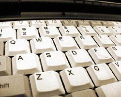

1873年：美国人鲍德温（F. Baldwin）利用自己过去发明的齿数可变齿轮制造了第一台手摇式计算机。

1886年：美国人Dorr E. Felt (1862-1930), 制造了第一台用按键操作的计算器。

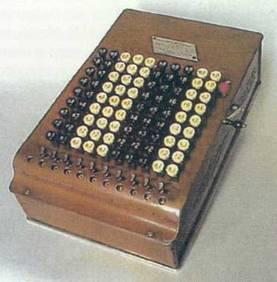

1890年：美国在第12次人口普查中使用了由统计学家霍列瑞斯（H.Hollerith）博士发明的制表机，从而完成了人类历史上第一次大规模数据处理。此后霍列瑞斯根据自己的发明成立了自己的制表机公司，并最终演变成为IBM公司。

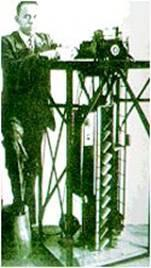

1893年：德国人施泰格尔研制出一种名为“大富豪”的计算机，该计算机是在手摇式计算机的基础上改进而来，并依*良好的运算速度和可*性而占领了当时的市场，直到1914年第一次世界大战爆发之前，这种“大富豪”计算机一直畅销不衰。

1895年： 英国青年工程师弗莱明（J.Fleming）通过“爱迪生效应”发明了人类第一只电子管。

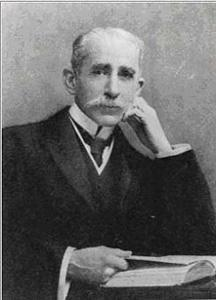

# 二、电子管时代【1911——1946】

1911年：6月15日，美国华尔街金融投资家弗林特（C.Flent）投资霍列瑞斯的制表机公司，成立了全新的CTR公司，但公司创立之初并没有涉足任何电子领域，反而生产诸如碎纸机或者土豆削皮机之类的产品。

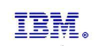

