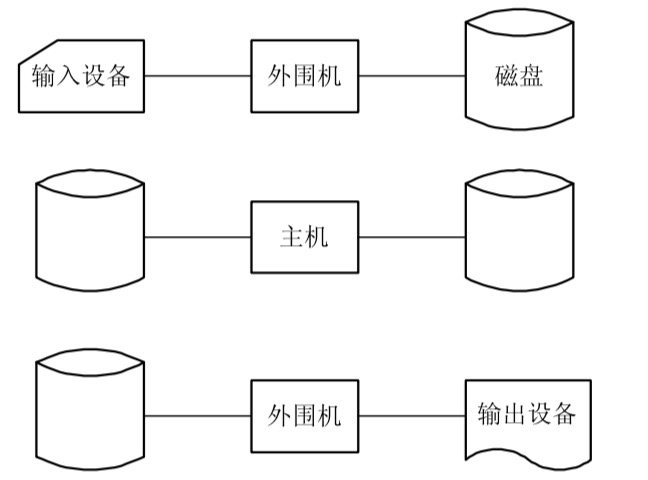

_OS的形成迄今已有50多年的时间。在上世纪50年代中期出现了单道批处理操作系统;60年代中期产生了多道程序批处理系统;不久又出现了基于多道程序的分时系统，与此同时也诞生了用于工业控制和武器控制的实时操作系统。20世纪80年代开始至21世纪初， 是微型机、多处理机和计算机网络高速发展的年代，同时也是微机OS、多处理机OS和网络OS以及分布式OS的形成和大发展的年代。_

# 一、无操作系统的计算机系统
## 1.人工操作方式
从第一台计算机诞生(1945年)到20世纪50年代中期的计算机，属于第一代计算机。此时的计算机是利用成千上万个真空管做成的，它的运行速度仅为每秒数千次，但体积却十分庞大，且功耗也非常高。这时还未出现OS。计算机操作是由用户(即程序员)采用人工操 作方式直接使用计算机硬件系统，即由程序员将事先已穿孔(对应于程序和数据)的纸带(或卡片)装入纸带输入机(或卡片输入机)，再启动它们将程序和数据输入计算机，然后启动计算机运行。当程序运行完毕并取走计算结果之后，才让下一个用户上机。这种人工操作方式有以下两方面的缺点：  

**(1) 用户独占全机。此时，计算机及其全部资源只能由上机用户独占。**  

**(2) CPU等待人工操作。当用户进行装带(卡)、卸带(卡)等人工操作时，CPU及内存等 资源是空闲的。** 

可见，人工操作方式严重降低了计算机资源的利用率，此即所谓的人机矛盾。随着CPU速度的提高和系统规模的扩大，人机矛盾变得日趋严重。此外，随着CPU速度的迅速提高 而I/O设备的速度却提高缓慢，这又使CPU与I/O设备之间速度不匹配的矛盾更加突出。 为了缓和此矛盾，曾先后出现了通道技术、缓冲技术，但都未能很好地解决上述矛盾，直至后来又引入了脱机输入/输出技术，才获得了较为令人满意的结果。

## 2.脱机输入/输出方式
为了解决人机矛盾及CPU和I/O设备之间速度不匹配的矛盾，20世纪50年代末出现了脱机输入/输出(Off-Line I/O)技术。该技术是事先将装有用户程序和数据的纸带(或卡片)装入纸带输入机(或卡片机)，在一台外围机的控制下，把纸带(卡片)上的数据(程序)输入到磁带上。当CPU需要这些程序和数据时，再从磁带上将其高速地调入内存。
类似地，当CPU需要输出时，可由CPU直接高速地把数据从内存送到磁带上，然后再在另一台外围机的控制下，将磁带上的结果通过相应的输出设备输出。图1-3示出了脱机输入/输出过程。由于程序和数据的输入和输
出都是在外围机的控制下完成的，或者说，
    
它们是在脱离主机的情况下进行的，故称为脱机输入/输出方式;反之，在主机的直接控制下进行输入/输出的方式称为联机 输入/输出(On-Line I/O)方式。这种脱机I/O方式的主要优点如下:

**(1) 减少了CPU的空闲时间。装带(卡)、 卸带(卡)以及将数据从低速I/O设备送到高 速磁带(或盘)上，都是在脱机情况下进行的，并不占用主机时间，从而有效地减少了CPU的空闲时间，缓和了人机矛盾。**

**(2) 提高了I/O速度。当CPU在运行中需要数据时，是直接从高速的磁带或磁盘上将数据调入内存的，不再是从低速I/O设备上输入，极大地提高了I/O速度，从而缓和了CPU和I/O设备速度不匹配的矛盾，进一步减少了CPU的空闲时间。**

  

