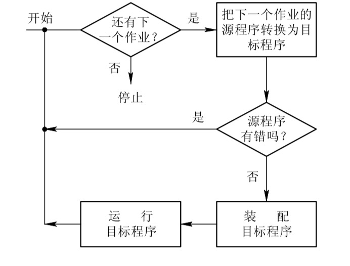
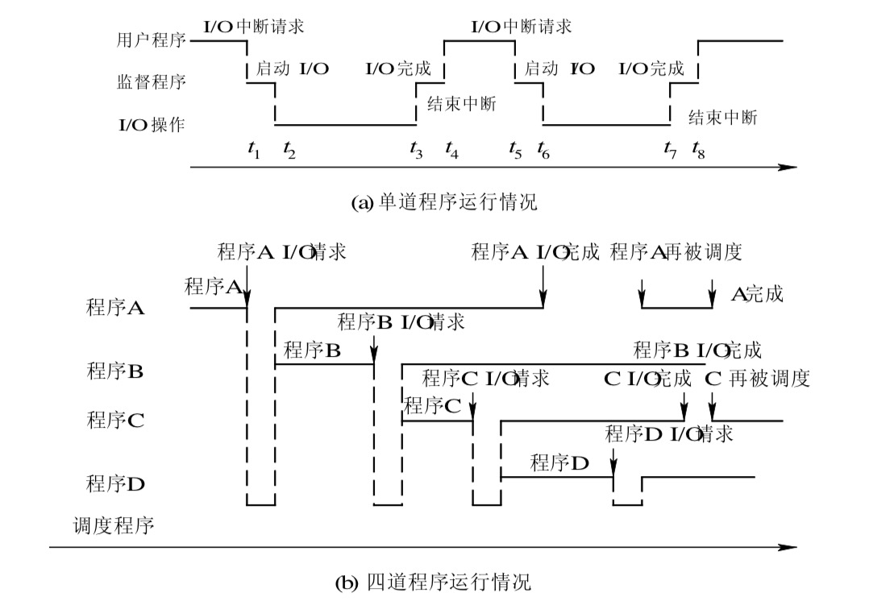

_OS的形成迄今已有50多年的时间。在上世纪50年代中期出现了单道批处理操作系统;60年代中期产生了多道程序批处理系统;不久又出现了基于多道程序的分时系统，与此同时也诞生了用于工业控制和武器控制的实时操作系统。20世纪80年代开始至21世纪初， 是微型机、多处理机和计算机网络高速发展的年代，同时也是微机OS、多处理机OS和网络OS以及分布式OS的形成和大发展的年代。_

# 一、无操作系统的计算机系统
## 1.人工操作方式
从第一台计算机诞生(1945年)到20世纪50年代中期的计算机，属于第一代计算机。此时的计算机是利用成千上万个真空管做成的，它的运行速度仅为每秒数千次，但体积却十分庞大，且功耗也非常高。这时还未出现OS。计算机操作是由用户(即程序员)采用人工操 作方式直接使用计算机硬件系统，即由程序员将事先已穿孔(对应于程序和数据)的纸带(或卡片)装入纸带输入机(或卡片输入机)，再启动它们将程序和数据输入计算机，然后启动计算机运行。当程序运行完毕并取走计算结果之后，才让下一个用户上机。这种人工操作方式有以下两方面的缺点：  

**(1) 用户独占全机。此时，计算机及其全部资源只能由上机用户独占。**  

**(2) CPU等待人工操作。当用户进行装带(卡)、卸带(卡)等人工操作时，CPU及内存等 资源是空闲的。** 

可见，人工操作方式严重降低了计算机资源的利用率，此即所谓的人机矛盾。随着CPU速度的提高和系统规模的扩大，人机矛盾变得日趋严重。此外，随着CPU速度的迅速提高 而I/O设备的速度却提高缓慢，这又使CPU与I/O设备之间速度不匹配的矛盾更加突出。 为了缓和此矛盾，曾先后出现了通道技术、缓冲技术，但都未能很好地解决上述矛盾，直至后来又引入了脱机输入/输出技术，才获得了较为令人满意的结果。

## 2.脱机输入/输出方式
为了解决人机矛盾及CPU和I/O设备之间速度不匹配的矛盾，20世纪50年代末出现了脱机输入/输出(Off-Line I/O)技术。该技术是事先将装有用户程序和数据的纸带(或卡片)装入纸带输入机(或卡片机)，在一台外围机的控制下，把纸带(卡片)上的数据(程序)输入到磁带上。当CPU需要这些程序和数据时，再从磁带上将其高速地调入内存。
类似地，当CPU需要输出时，可由CPU直接高速地把数据从内存送到磁带上，然后再在另一台外围机的控制下，将磁带上的结果通过相应的输出设备输出。图1-3示出了脱机输入/输出过程。由于程序和数据的输入和输
出都是在外围机的控制下完成的，或者说，
    
它们是在脱离主机的情况下进行的，故称为脱机输入/输出方式;反之，在主机的直接控制下进行输入/输出的方式称为联机 输入/输出(On-Line I/O)方式。这种脱机I/O方式的主要优点如下:

**(1) 减少了CPU的空闲时间。装带(卡)、 卸带(卡)以及将数据从低速I/O设备送到高 速磁带(或盘)上，都是在脱机情况下进行的，并不占用主机时间，从而有效地减少了CPU的空闲时间，缓和了人机矛盾。**

**(2) 提高了I/O速度。当CPU在运行中需要数据时，是直接从高速的磁带或磁盘上将数据调入内存的，不再是从低速I/O设备上输入，极大地提高了I/O速度，从而缓和了CPU和I/O设备速度不匹配的矛盾，进一步减少了CPU的空闲时间。**

# 二、单道批处理系统
## 1.单道批处理系统的处理过程
上世纪 50 年代中期发明了晶体管，人们开始用晶体管替代真空管来制作计算机，从而出现了第二代计算机。它不仅使计算机的体积大大减小，功耗显著降低，同时可靠性也得到大幅度提高，使计算机已具有推广应用的价值，但计算机系统仍非常昂贵。为了能充分地利用它，应尽量让该系统连续运行，以减少空闲时间。为此，通常是把一批作业以脱机方式输入到磁带上，并在系统中配上监督程序(Monitor)，在它的控制下使这批作业能一个接一个地连续处理。其自动处理过程是:首先，由监督程序将磁带上的第一个作业装入内存，并把运行控制权交给该作业。当该作业处理完成时，又把控制权交还给监督程序，再由监督程序把磁带(盘)上的第二个作业调入内存。计算机系统就这样自动地一个作业一个作业地进行处理，直至磁带(盘)上的所有作业全部完成，这样便形成了早期的批处理系统。由于系统对作业的处理都是成批地进行的，且在内存中始终只保持一道作业，故称此系统为单道批处理系统(Simple Batch Processing System)。

由上所述不难看出，单道批处理系统是在解决人机矛盾以及CPU与I/O设备速度不匹配问题的过程中形成的。换言之，批处理系统旨在提高系统资源的利用率和系统吞吐量。 但这种单道批处理系统仍然不能很好地利用系统资源，故现已很少使用。

## 2.单道批处理系统的特征
单道批处理系统是最早出现的一种OS。严格地说，它只能算作是OS的前身而并非是现在人们所理解的OS。尽管如此，该系统比起人工操作方式的系统已有很大进步。该系统的主要特征如下:

**(1) 自动性。在顺利情况下，在磁带上的一批作业能自动地逐个地依次运行，而无需人工干预。**

**(2) 顺序性。磁带上的各道作业是顺序地进入内存，各道作业的完成顺序与它们进入内存的顺序，在正常情况下应完全相同，亦即先调入内存的作业先完成。**

**(3) 单道性。内存中仅有一道程序运行，即监督程序每次从磁带上只调入一道程序进入 内存运行，当该程序完成或发生异常情况时，才换入其后继程序进入内存运行。**

# 三、多道批处理系统
20 世纪60年代中期，人们开始利用小规模集成电路来制作计算机，生产出第三代计算机。由IBM公司生产的第一台小规模集成电路计算机——360机，较之于晶体管计算机， 无论在体积、功耗、速度和可靠性上，都有了显著的改善。虽然在开发360机器使用的操作系统时，为能在机器上运行多道程序而遇到了极大的困难，但最终还是成功地开发出能在一台机器中运行多道程序的操作系统OS/360。

## 1.多道程序设计的基本概念
在单道批处理系统中，内存中仅有一道作业，它无法充分利用系统中的所有资源，致使系统性能较差。为了进一步提高资源的利用率和系统吞吐量，在20世纪60年代中期又引入了多道程序设计技术，由此而形成了多道批处理系统(Multiprogrammed Batch Processing System)。在该系统中，用户所提交的作业都先存放在外存上并排成一个队列，称为“后备 队列”;然后，由作业调度程序按一定的算法从后备队列中选择若干个作业调入内存，使它
们共享CPU和系统中的各种资源。具体地说，在OS中引入多道程序设计技术可带来以下好处:

(1) 提高 CPU 的利用率。当内存中仅有一道程序时，每逢该程序在运行中发出I/O请求后，CPU空闲，必须在其I/O完成后CPU才继续运行;尤其因I/O设备的低速性，更使CPU的利用率显著降低。从下图a中可以看出:在 t2~t3、 t6~t7 时间间隔内CPU空闲。在引入多道程序设计技术后，由于同时在内存中装有若干道程序，并使它们交替地运行，这样，当正在运行的程序因I/O而暂停执行时，系统可调度另一道程序运行，从而保持了CPU处于忙碌状态。如下图b所示：

(2) 可提高内存和I/O设备利用率。为了能运行较大的作业，通常内存都具有较大容量，但由于80%以上的作业都属于中小型，因此在单道程序环境下，也必定造成内存的浪费。 类似地，对于系统中所配置的多种类型的I/O设备，在单道程序环境下也不能充分利用。如果允许在内存中装入多道程序，并允许它们并发执行，则无疑会大大提高内存和I/O设备的利用率。

(3) 增加系统吞吐量。在保持CPU、I/O设备不断忙碌的同时，也必然会大幅度地提高系统的吞吐量，从而降低作业加工所需的费用。

## 2.多道批处理系统的优缺点
虽然早在20世纪60年代就已出现了多道批处理系统，但至今它仍是三大基本操作系统类型之一。在大多数大、中、小型机中都配置了它，说明它具有其它类型 OS 所不具有的 优点。多道批处理系统的主要优缺点如下:

(1) 资源利用率高。由于在内存中驻留了多道程序，它们共享资源，可保持资源处于忙 碌状态，从而使各种资源得以充分利用。

(2) 系统吞吐量大。系统吞吐量是指系统在单位时间内所完成的总工作量。能提高系统吞吐量的主要原因可归结为:第一，CPU 和其它资源保持“忙碌”状态; 第二，仅当作业 完成时或运行不下去时才进行切换，系统开销小。

(3) 平均周转时间长。作业的周转时间是指从作业进入系统开始，直至其完成并退出系统为止所经历的时间。在批处理系统中，由于作业要排队，依次进行处理，因而作业的周转时间较长，通常需几个小时，甚至几天。

(4) 无交互能力。用户一旦把作业提交给系统后，直至作业完成，用户都不能与自己的作业进行交互，这对修改和调试程序是极不方便的。

## 3.多道批处理系统需要解决的问题
多道批处理系统是一种有效、但十分复杂的系统。为使系统中的多道程序间能协调地运行，必须解决下述一系列问题。

(1) 处理机管理问题。在多道程序之间，应如何分配被它们共享的处理机，使CPU既能满足各程序运行的需要，又能提高处理机的利用率，以及一旦把处理机分配给某程序后， 又应在何时收回等一系列问题，属于处理机管理问题。

(2) 内存管理问题。应如何为每道程序分配必要的内存空间，使它们“各得其所”且不 致因相互重叠而丢失信息，以及应如何防止因某道程序出现异常情况而破坏其它程序等问题，就是内存管理问题。

(3) I/O设备管理问题。系统中可能具有多种类型的I/O设备供多道程序所共享，应如何分配这些I/O设备，如何做到既方便用户对设备的使用，又能提高设备的利用率，这就是I/O设备管理问题。

(4) 文件管理问题。在现代计算机系统中，通常都存放着大量的程序和数据(以文件形式存在)，应如何组织这些程序和数据，才能使它们既便于用户使用，又能保证数据的安全 性和一致性，这些属于文件管理问题。

(5) 作业管理问题。对于系统中的各种应用程序，其中有的属于计算型，即以计算为主的程序;有的属于I/O型，即以I/O为主的程序;又有些作业既重要又紧迫;而有的作业则要求系统能及时响应，这时应如何组织这些作业，这便是作业管理问题。

为此，应在计算机系统中增加一组软件，用以对上述问题进行妥善、有效的处理。这组软件应包括:能控制和管理四大资源的软件，合理地对各类作业进行调度的软件，以及方便用户使用计算机的软件。正是这样一组软件构成了操作系统。据此，我们可把操作系统定义为:操作系统是一组控制和管理计算机硬件和软件资源，合理地对各类作业进行调度，以及方便用户使用的程序的集合。

# 四、分时系统
## 1.分时系统的产生
分时系统(Time Sharing System)与多道批处理系统之间有着截然不同的性能差别，它能很好地将一台计算机提供给多个用户同时使用，提高计算机的利用率。它被经常应用于查询系统中，满足许多查询用户的需要。用户的需求具体表现在以下几个方面:

(1) 人-机交互。每当程序员写好一个新程序时，都需要上机进行调试。由于新编程序难免有些错误或不当之处需要修改，因而希望能像早期使用计算机时一样对它进行直接控制，并能以边运行边修改的方式，对程序中的错误进行修改，亦即，希望能进行人-机交互。

(2) 共享主机。在20世纪60年代计算机非常昂贵，不可能像现在这样每人独占一台微机，而只能是由多个用户共享一台计算机，但用户在使用机器时应能够像自己独占计算机一样，不仅可以随时与计算机交互，而且应感觉不到其他用户也在使用该计算机。

(3) 便于用户上机。在多道批处理系统中，用户上机前必须把自己的作业邮寄或亲自送到机房。这对于用户尤其是远地用户来说是十分不便的。用户希望能通过自己的终端直接将作业传送到机器上进行处理，并能对自己的作业进行控制。

由上所述不难得知，分时系统是指，在一台主机上连接了多个带有显示器和键盘的终端，同时允许多个用户通过自己的终端，以交互方式使用计算机，共享主机中的资源。 

第一台真正的分时操作系统(CTSS，Compatable Time Sharing System)是由麻省理工学院 开发成功的。继CTSS成功后，麻省理工学院又和贝尔实验室、通用电气公司联合开发出多用户多任务操作系统——MULTICS，该机器能支持数百用户。值得一提的是，参加MULTICS
研制的贝尔实验室的Ken Thempson，在PDP-7小型机上开发出一个简化的MULTICS版本， 它就是当今广为流行的UNIX操作系统的前身。

## 2.分时系统实现中的关键问题
为实现分时系统，必须解决一系列问题。其中最关键的问题是如何使用户能与自己的作业进行交互，即当用户在自己的终端上键入命令时，系统应能及时接收并及时处理该命令，再将结果返回给用户。此后，用户可继续键入下一条命令，此即人-机交互。应强调指出，即使有多个用户同时通过自己的键盘键入命令，系统也应能全部地及时接收并处理这些命令。

(1) 及时接收。要及时接收用户键入的命令或数据并不困难，为此，只需在系统中配置 一个多路卡。例如，当要在主机上连接8个终端时，须配置一个8用户的多路卡。多路卡的作用是使主机能同时接收各用户从终端上输入的数据。此外，还须为每个终端配置一个缓冲区，用来暂存用户键入的命令(或数据)。

(2) 及时处理。人机交互的关键，是使用户键入命令后能及时地控制自己作业的运行， 或修改自己的作业。为此，各个用户的作业都必须在内存中，且应能频繁地获得处理机而运行;否则，用户键入的命令将无法作用到自己的作业上。前面介绍的批处理系统是无法实现人机交互的。因为通常大多数作业都还驻留在外存上，即使是已调入内存的作业，也经常要经过较长时间的等待后方能运行，因而使用户键入的命令很难及时作用到自己的作业上。

由此可见，为实现人机交互，必须彻底地改变原来批处理系统的运行方式。首先，用户作业不能先进入磁盘，然后再调入内存。因为作业在磁盘上不能运行，当然用户也无法与机器交互，因此，作业应直接进入内存。其次，不允许一个作业长期占用处理机，直至它运行结束或出现I/O请求后，方才调度其它作业运行。为此，应该规定每个作业只运行一个很短的时间(例如 0.1 秒钟，通常把这段时间称为时间片)，然后便暂停该作业的运行，并立即调度下一个程序运行。如果在不长的时间(如3秒)内能使所有的用户作业都执行一次 (一个时间片的时间)，便可使每个用户都能及时地与自己的作业交互，从而可使用户的请求得到及时响应。

## 3.分时系统的特征
分时系统与多道批处理系统相比，具有非常明显的不同特征，由上所述可以归纳成以下四个特点:

(1) 多路性。允许在一台主机上同时联接多台联机终端，系统按分时原则为每个用户服务。宏观上，是多个用户同时工作，共享系统资源;而微观上，则是每个用户作业轮流运行一个时间片。多路性即同时性，它提高了资源利用率，降低了使用费用，从而促进了计算机更广泛的应用。

(2) 独立性。每个用户各占一个终端，彼此独立操作，互不干扰。因此，用户所感觉到的，就像是他一人独占主机。

(3) 及时性。用户的请求能在很短的时间内获得响应。此时间间隔是以人们所能接受的等待时间来确定的，通常仅为 1~3 秒钟。

(4) 交互性。用户可通过终端与系统进行广泛的人机对话。其广泛性表现在:用户可以请求系统提供多方面的服务，如文件编辑、数据处理和资源共享等。

# 五、实时系统

所谓“实时”，是表示“及时”，而实时系统(Real Time System)是指系统能及时(或即时) 响应外部事件的请求，在规定的时间内完成对该事件的处理，并控制所有实时任务协调一致地运行。