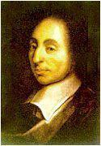
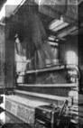
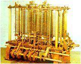
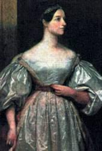
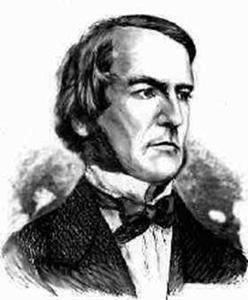
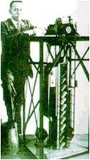
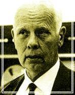

# 一、史前时代【1623——1895】
1623年：德国科学家契克卡德（W. Schickard）制造了人类有史以来第一台机械计算机，这台机器能够进行六位数的加减乘除运算。

1642年：法国科学家帕斯卡（B.Pascal）发明了著名的帕斯卡机械计算机，首次确立了计算机器的概念。

1674年：莱布尼茨改进了帕斯卡的计算机，使之成为一种能够进行连续运算的机器，并且提出了“二进制”数的概念。（据说这个概念来源于中国的八卦）

1725年：法国纺织机械师布乔（B.Bouchon）发明了“穿孔纸带”的构想。

1805年： 法国机械师杰卡德（J.Jacquard）根据布乔“穿孔纸带”的构想完成了“自动提花编织机”的设计制作，在后来电子计算机开始发展的最初几年中，在多款著名计算机中我们均能找到自动提花机的身影。

1822年：英国科学家巴贝奇（C.Babbage）制造出了第一台差分机，它可以处理3个不同的5位数，计算精度达到6位小数。

1834年：巴贝奇提出了分析机的概念，机器共分为三个部分：堆栈，运算器，控制器。他的助手， 英国著名诗人拜伦的独生女阿达.奥古斯塔（Ada Augusta）为分析机编制了人类历史上第一批计算机程序。阿达和巴贝奇为计算机的发展创造了不朽的功勋，他们对计算机的预见起码超前了一个世纪以上，正是他们的辛勤努力，为后来计算机的出现奠定了坚实的基础。

1847年：英国数学家布尔（G.Boole）发表著作《逻辑的数学分析》。

1854年：布尔发表《思维规律的研究——逻辑与概率的数学理论基础》，并综合自己的另一篇文章《逻辑的数学分析》，从而创立了一门全新的学科－布尔代数，为百年后出现的数字计算机的开关电路设计提供了重要的数学方法和理论基础。

1868年：美国新闻工作者克里斯托夫.肖尔斯（C.Sholes）发明了沿用至今的QWERTY键盘。

1873年：美国人鲍德温（F. Baldwin）利用自己过去发明的齿数可变齿轮制造了第一台手摇式计算机。

1886年：美国人Dorr E. Felt (1862-1930), 制造了第一台用按键操作的计算器。

1890年：美国在第12次人口普查中使用了由统计学家霍列瑞斯（H.Hollerith）博士发明的制表机，从而完成了人类历史上第一次大规模数据处理。此后霍列瑞斯根据自己的发明成立了自己的制表机公司，并最终演变成为IBM公司。

1893年：德国人施泰格尔研制出一种名为“大富豪”的计算机，该计算机是在手摇式计算机的基础上改进而来，并依*良好的运算速度和可*性而占领了当时的市场，直到1914年第一次世界大战爆发之前，这种“大富豪”计算机一直畅销不衰。

1895年： 英国青年工程师弗莱明（J.Fleming）通过“爱迪生效应”发明了人类第一只电子管。

# 二、电子管时代【1911——1946】

1911年：6月15日，美国华尔街金融投资家弗林特（C.Flent）投资霍列瑞斯的制表机公司，成立了全新的CTR公司，但公司创立之初并没有涉足任何电子领域，反而生产诸如碎纸机或者土豆削皮机之类的产品。

1912年：美国青年发明家德.福雷斯特（L.De Forest）在帕洛阿托小镇首次发现了电子管的放大作用，为电子工业奠定了基础，而今日的帕洛阿托小镇也已成为硅谷的中心地带。

1913年：美国麻省理工学院教授万.布什（V.Bush）领导制造了模拟计算机“微分分析仪”。机器采用一系列电机驱动，利用齿轮转动的角度来模拟计算结果。

1924年：硅谷之父特曼担任斯坦福大学教授，对创建HP、成立斯坦福工业园区起到决定性作用。2月，由霍列瑞斯创办的制表机公司几经演变，最终更名为国际商用机器公司，即我们今天看到的IBM。

1935年：IBM制造了IBM601穿孔卡片式计算机，该计算机能够在一秒钟内计算出乘法运算。

20多岁的德国工程师楚泽（K.Zuse）研制出了机械可编程计算机Z1，并采用了二进制形式，其理论基础即来源于布尔代数。

1937年：11月，美国AT&T贝尔实验室研究人员斯蒂比兹（G. Stibitz）制造了电磁式数字计算机“Model-K”。

1939年：元旦，美国斯坦福大学研究生比尔.休利特（B.Hewllet）和戴维.帕卡德（D.Packard）正式签署企业合伙协议，创办了Hewllet-Packard（HP)公司，即国内通称的惠普公司。

9月，贝尔实验室研制出M－1型计算机。

10 月，约翰.阿塔纳索夫（John Vincent Atanasoff(1903-1995)）制造了后来举世闻名的ABC计算机的第一台样机，并提出了计算机的三条原则，

（1）以二进制的逻辑基础来实现数字运算，以保证精度； 

（2）利用电子技术来实现控制，逻辑运算和算术运算，以保证计算速度；
 
（3）采用把计算功能和二进制数更新存贮的功能相分离的结构。这就是著名的计算机三原则。

1940 年：9月，贝尔实验室在美国达特默思大学演示M—1型机。他们用电报线把安置在校园内的M—1型机和相连，当场把一个数学问题打印出来并传输到纽约，M— 1型机在达特默思大学的成功表演，首次实现了人类对计算机进行的远距离控制的梦想。 控制论之父维纳提出了计算机五原则，

（1）不是模拟式，而是数字式；

（2）由电子元件构成，尽量减少机械部件；

（3）采用二进制，而不是十进制；

（4）内部存放计算表；

（5）在计算机内部存贮数据。

1941年：楚泽完成了Z3计算机的研制工作，这是第一台可编程的电子计算机。可处理7位指数、14位小数。使用了大量的真空管。每秒种能作3到4次加法运算，一次乘法需要3到5秒。

1942 年：时任美国依阿华州立大学数学物理教授的阿塔纳索夫（John V. Atanasoff）与研究生贝瑞（Clifford Berry）组装了著名的ABC（Atanasoff-Berry Computer）计算机，共使用了300 多个电子管，这也是世界上第一台具有现代计算机雏形的计算机。但是由于美国政府正式参加第二次世界大战，致使该计算机并没有真正投入运行。

1943年：10月，绰号为“巨人”的用来破译德军密码的计算机在英国布雷契莱庄园制造成功，此后又制造多台，为第二次世界大战的胜利立下了汗马功劳。

1944 年：8月7日，由IBM出资，美国人霍德华.艾肯（H.Aiken）负责研制的马克1号计算机在哈佛大学正式运行，它装备了15万个元件和长达800公里的电线， 每分钟能够进行200次以上运算。女数学家格雷斯.霍波（G.Hopper）为它编制了计算程序，并声明该计算机可以进行微分方程的求解。马克1号计算机的问世不但实现了巴贝奇的夙愿，而且也代表着自帕斯卡计算机问世以来机械计算机和电动计算机的最高水平。

1946 年：2月14日，美国宾西法尼亚大学摩尔学院教授莫契利（J. Mauchiy）和埃克特（J.Eckert）共同研制成功了 ENIAC  (Electronic Numerical Integrator And Computer):计算机。这台计算机总共安装了17468只电子管，7200个二极管，70000多电阻器，10000多 只电容器和6000只继电器，电路的焊接点多达 50万个,机器被安装在一排2.75米高的金属柜里，占地面积为170平方米左右，总重量达到30吨，其运算速度达到每秒钟5000次加法，可以在 3/1000秒时间内做完两个10位数乘法。

# 三、晶体管时代【1947——1958】

1947年：12月23号，贝尔实验室的肖克利 (William B. Shockley)，布拉顿(John Bardeen)，巴丁 (Walter H. Brattain)创造出了世界上第一只半导体放大器件，他们将这种器件重新命名为“晶体管” 从上到下依次为：肖克利，布拉顿和巴丁

1948 年：6月10日，香农在《贝尔系统技术杂志》（Bell System Technical Journal）上连载发表了他影像深远的论文《通讯的数学原理》，并于次年在同一杂志上发表了自己的另一著名论文《噪声下的通信》。在这两篇论文中，香农阐明了通信的基本问题，给出了通信系统的模型，提出了信息量的数学表达式，并解决了信道容量、信源统计特性、信源编码、信道编码等一系列基本技术问题。两篇论文成为了信息论的奠基性著作，此时尚不足三十岁的香农也成为了信息论的奠基人。

12月，ENAIC的两位缔造者共同创办了世界上第一家电脑公司“埃克特—莫契利计算机公司”（EMCC）。

1949 年：当时尚在美国哈佛大学计算机实验室的上海籍华人留学生王安向美国国家专利局申请了磁芯的专利。贝尔实验室制造了M系列计算机的最后一个型号：M－6，并从此不在涉足计算机的研制与生产。贝尔实验室所研制的M系列继电器计算机，是从机械计算机过波到电子计算机的重要桥梁。

9月，“马克”3号计算机研制成功，“马克”3号也是霍德华.艾肯研制的第一台内存程序的大型计算机，他在这台计算机上首先使用了磁鼓作为数与指令的存储器，这是计算机发展史上的一项重大改进，从此磁鼓成为第一代电子管计算机中广泛使用的存储器。

英国剑桥大学数学实验室的Wilkes和他的小组建成了一台存储程序的计算机EDSAC，输入输出设备仍是纸带。

1950年：东京帝国大学的Yoshiro Nakamats发明了软磁盘，从而开创了计算机存储的新纪元。

10月，阿兰.图灵发表自己另外一篇及其重要的论文《机器能思考吗》，从而为人工智能奠定了基础，图灵也获得了“人工智能之父”的美誉。甚至有人说在第一代电脑占统治地位的那个时代，这篇论文我们可以把它看作第五代，第六代电脑的宣言书。

1951年：6月14日，当时已在雷明顿—兰德（Remington-Rand）公司任职的莫契利和埃克特再次联袂制造的UNIVAC计算机正式移交美国人口普查局使用，从而使电脑走出了实验室，开始为人类社会服务，从此人类社会进入了计算机时代。

6月，王安创办了王安实验室，即王安电脑公司的前身，从此开始了王安电脑传奇般的历程。

1952 年：1月，由计算机之父，冯.诺伊曼（Von Neumann）设计的IAS电子计算机EDVAC问世。这台IAS计算机总共采用了2300个电子管，运算速度却比拥有18000个电子管的“埃尼阿克”提高了10倍，冯.诺伊曼的设想在这台计算机上得到了圆满的体现。

1953年：4月7日，IBM正式对外发布自己的第一台电子计算机 IBM701。并邀请了冯.诺依曼、肖克利和奥本海默等人共150名各界名人出席揭幕仪式，为自己的第一台计算机宣传。

8月，IBM发布了应用与会计行业的IBM702计算机。

IBM推出了中型计算机IBM650，以低廉的价格和优异的性能在市场中获得了极大的成功，至此，IBM在市场中确立了领导者的地位。

贝尔实验室使用800只晶体管组装了世界上第一台晶体管计算机TRADIC。

1956 年：美国达特莫斯大学（Dartmouth）青年助教麦卡锡，哈佛大学明斯基、贝尔实验室香农（E.Shannon）和IBM公司信息研究中心罗彻斯特（N. Lochester）共同在达特莫斯大学举办了一个沙龙式的学术会议，他们邀请了卡内基—梅隆大学纽厄尔和赫伯特.西蒙、麻省理工学院塞夫里奇（O. Selfridge）和索罗门夫（R.Solomamff），以及IBM公司塞缪尔（A.Samuel）和莫尔（T.More）。这就是著名的“达特莫斯”会议。在经过充分的讨论后，他们首次提出了“人工智能”这一术语，从而标志着人工智能作为一门新兴学科的出现。

9月，IBM的一个工程小组向世界展示了第一台磁盘存储系统 IBM 350 RAMAC（Random Access Method of Accounting and Control）

