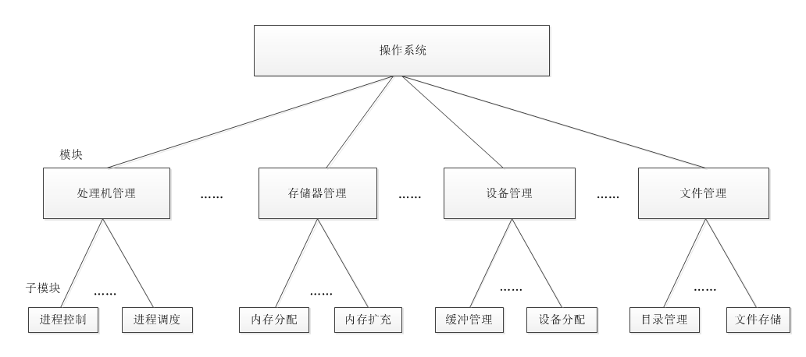

# 操作系统的结构设计
>> 早期的 OS 设计比较简单，由一个人花费几个月的时间去编织一个 OS。随着 OS 的规模越来越大，所具有的代码也越来越多，往往需要数十人或者数百人来参与 OS 的参与，分工合作，共同完成操作系统的设计。

## 无结构 OS
早期开发操作系统时，设计者只是把注意力放在功能的实现和或得高的效率上，缺乏首尾一致的设计思想。这种 OS 是无结构的，也有人称为整体系统结构。

- 优点：  
快速开发，能有效利用内存

- 缺点：
内部实现复杂混乱，难以调试。增加了维护人员的负担

## 模块化结构 OS
为使 OS 具有较清晰的结构，OS 不再是由众多的过程直接构成，而是将 OS 按功能划分为若干个具有一定独立性和大小的模块。每个模块具有某一方面的管理功能，各模块直接通过接口实现交互。然后再进一步将各模块细分为具有一定功能的子模块。
我们把这种设计方法称为模块-接口法，由此构成的操作系统就是具有模块化结构的操作系统。

- 优点：  
提高 OS 的正确性，可理解性和维护性；增强 OS 的适应性；加速 OS 的开发过程

- 缺点：
各模块间的接口规定很难满足在模块完成后对接口的实际需求；各模块设计齐头并进，无法寻找到一个可靠的决定顺序，造成各模块直接的无序性。

## 分层式结构 OS
为了将模块-接口法中 “决定顺序” 的无序性变为有序性，引入了有序分层法。分层法的设计任务是：在目标 An 和裸机 A0 之间，铺设若干个层次的软件 A1、A2、A3....., 使 An 通过这些层，最终能在 A0 上运行。在操作系统中，常采用自底向上法来铺设这些中间层。  

自底向上法：  
每一步设计都建立在可靠的基础上，为此规定，每一层仅能使用其底层所提供的功能和服务，这样可使系统的调试和验证都变得容易。

- 优点  
易保证系统的正确性；易扩展和易维护性；

- 缺点  
系统效率降低，OS 每执行一个功能，通常需要自上而下地穿越多个层次，增加系统的通信开销，导致系统效率的降低。

## 微内核 OS
微内核（Micro Kernel）操作系统结构能有效的处理多处理机运行，非常适用于分布式系统环境。当前比较流行的，能支持多处理机运行的 OS，几乎全部采用的是微内核结构。  

微内核结构的特点：
- 足够小的内核：实现了现在OS最基本核心功能的部分
- 基于客户/服务器（C/S）模式
- 应用“机制与策略分离”原理
- 采用面向对象技术

微内核结构的基本功能：  
- 进程（线程）管理
- 低级存储器管理
- 中断和陷入处理
- 采用面向对象技术

优点：  
- 提高了系统的可扩展性
- 增强了系统的可靠性
- 提高了可移植性
- 提供了对分布式系统的支持
- 融入了面向对象的技术

主要缺点：较早期的 OS ，运行效率有所降低

>> 补充： 客户端/服务器模式，简称 C/S 模式，不论是 LAN, 还是企业网，目前都广泛采用了 C/S 模式。C/S 系统主要由客户机、服务器和网络系统三部分组成。
- C/S 模式优点：数据的分布式处理和存储；便于集中管理；灵活性和可扩充性；易于改编应用软件；
- C/S 模式缺点：存在着不可靠性和性能瓶颈的问题。在系统仅有一个服务器时候，一旦服务器故障，将导致整个网络瘫痪。所以需要设计合理的系统架构来提高服务的可靠性。